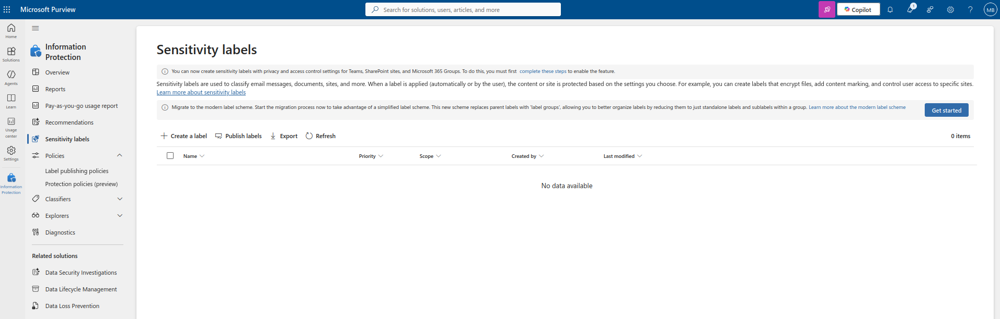
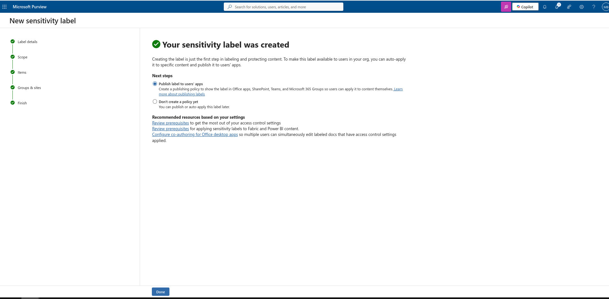
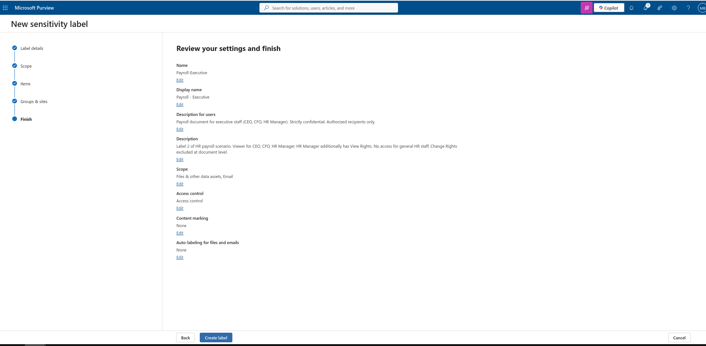

# Microsoft Purview — Sensitivity Labels: Practical Scenarios

This project documents a hands-on exploration of Microsoft Purview Information Protection, focusing on Sensitivity Labels and their practical application in real-world business scenarios.

Rather than following a generic tutorial, each scenario in this project is modeled after common organizational challenges — data classification, access control, external sharing, and compliance requirements — the kind of situations encountered in companies of any size.

The goal is not just to configure labels, but to understand the reasoning behind each design decision: who needs access, what actions should be permitted or restricted, and why a particular configuration was chosen over alternatives.

## What this project covers

Two scenarios are presented, each addressing a different aspect of information protection. Scenario 1 focuses on internal HR document control with external distribution — demonstrating access control, permission granularity, and GDPR considerations. Scenario 2 focuses on external collaboration — demonstrating how protection works when multiple parties outside the organization need controlled access to the same document.

Each scenario is documented in full: business justification, design decisions with trade-offs, configuration details, and observed behavior during testing. Depth over breadth — two complete scenarios demonstrate more than four superficial ones.

## Environment

| | |
|---|---|
| Tenant | Microsoft 365 Business Premium — contact@mariusbrinaru.de |
| Portal | Microsoft Purview compliance portal |

---

## Scenario 1 – Internal Strict Document (HR / Payroll)

---

### Label 1 — Payroll Standard

#### Business Justification

Monthly payroll documents for general staff contain personal and financial data protected under GDPR. These documents are generated as final outputs from the payroll system and must be distributed both internally to management and externally to each employee. Once generated, no modifications are permitted — any corrections must be made in the source payroll system, not in the document itself.

#### Audience

| Recipient | Type |
|---|---|
| All HR team members, HR Manager, CFO, CEO | Internal |
| The respective employee, via their personal email address | External |

#### Permissions

| Recipient | Permissions |
|---|---|
| All internal recipients | Viewer only — no print, no copy, no edit |
| HR Manager, CFO, CEO | View Rights additionally granted — change rights deliberately excluded |
| Employee (external) | View Content, Print, Copy, Forward — edit, save as unprotected, and change rights excluded |

#### Design Decisions

**Why Viewer for all internal recipients, including HR?**
Payroll documents are final at the point of distribution. Granting edit rights to HR staff would create a risk of unauthorized modification after official generation. Corrections follow a formal process through the payroll system itself.

**Why no Change Rights for management?**
Permissions management is the responsibility of the Compliance Administrator, not individual managers. Granting Change Rights to CEO or CFO would technically allow them to escalate their own privileges or modify access for others — a risk that outweighs the convenience. View Rights are sufficient for oversight purposes.

**Why does the employee receive broader permissions than internal management?**
Internal recipients need to see the document, not use it freely. The employee, however, is the legal subject of the data contained in the document and has the right to use it freely — printing for personal records, sharing with a bank or accountant, or archiving it. Restricting these actions would be inconsistent with GDPR data subject rights.

**Why allow external access at all?**
Employees have a legal right to receive their own payroll documents. Restricting access to corporate email only would exclude employees who primarily use personal devices or who have left the company. Once delivered, responsibility for further distribution rests with the employee.

> **Known limitation:** Once the employee accesses the document, Purview cannot prevent them from sharing an unprotected copy through a screenshot or other means. This is an accepted limitation — the label protects against unauthorized third-party access, not against the document owner's own actions.

---

### Label 2 — Payroll Executive

#### Business Justification

Payroll documents for executives (CEO, CFO, HR Manager) require a higher level of confidentiality than standard payroll. These documents must not be accessible to general HR staff, as they contain compensation details for senior leadership. Access is restricted to the minimum set of authorized individuals consistent with the principle of least privilege.

#### Audience

| Recipient | Type |
|---|---|
| HR Manager, CFO, CEO only | Internal |
| The respective executive, via their personal email address | External |

#### Permissions

| Recipient | Permissions |
|---|---|
| All internal recipients | Viewer only — no print, no copy, no edit |
| HR Manager, CFO, CEO | View Rights additionally granted |
| Executive employee (external) | View Content, Print, Copy, Forward — edit, save as unprotected, and change rights excluded |
| Change Rights | Not granted to anyone at document level — managed exclusively at tenant level by Compliance Administrator |

#### Design Decisions

**Why exclude general HR staff?**
While HR staff process standard payroll, executive compensation is typically handled by a smaller, explicitly authorized group. Broad HR access to executive documents creates unnecessary exposure and violates the principle of least privilege.

**Why not grant HR Manager edit rights, given they may oversee corrections?**
The same principle applies as in Label 1 — corrections are made upstream in the payroll system. If HR Manager needs to annotate or comment, that happens through a separate internal process, not by modifying the protected document.

**Why does the executive employee receive the same broader permissions as in Label 1?**
The legal reasoning is identical — the executive is the data subject and retains the right to use their own payroll document freely. Their seniority within the organization does not reduce their rights as an individual.

**Why no Change Rights even for HR Manager?**
HR Manager has View Rights for oversight. Granting Change Rights would allow privilege escalation — adding themselves or others with elevated permissions. This risk is not justified by any operational need, as permissions are managed centrally by the Compliance Administrator.

---

### Screenshots

**Initial state** — Sensitivity Labels before any configuration:

---

#### Label 1 — Payroll Standard

**Step 1 — Adding recipients**
`contact@mariusbrinaru.de` (internal) was added first — visible in the background as Viewer. In the foreground: employee permissions being configured — Print, Copy, Forward enabled. Edit, Save, Change Rights excluded:

**Step 2 — View Rights for internal** (`contact@mariusbrinaru.de`)
View Rights (VIEWRIGHTSDATA) added to the internal recipient. Both recipients now in the list:

**Step 3 — Access Control final state**
Both recipients assigned. Expiry: Never. Offline access: 7 days:

**Step 4 — Review & Finish**

**Step 5 — Created**

---

#### Label 2 — Payroll Executive

**Step 1 — Access Control final state**
Same permission structure as Label 1. General HR staff excluded:

**Step 2 — Review & Finish**

<!-- TODO: Add screenshot – Payroll Executive created confirmation -->

---

#### Final state — Both labels

<!-- TODO: Add screenshot – Sensitivity Labels list with Payroll-Standard and Payroll-Executive -->

### Test Environment Note

This project was built on a personal single-user Microsoft 365 Business Premium tenant (contact@mariusbrinaru.de). No additional user licenses were provisioned. Roles are simulated as follows:

- `contact@mariusbrinaru.de` → represents all internal recipients (HR staff, HR Manager, CFO, CEO)
- `brinaru.marius@gmail.com` → represents the external employee

In a production environment, internal recipients would be defined as security groups (e.g. `HR-Team`, `Finance-Leadership`) rather than individual addresses.

---

### Publishing Policy — HR-Payroll-Policy

Both labels were published under a single policy named **HR-Payroll-Policy** with the following deliberate settings:

**Justification required to remove or downgrade a label** — enabled. Any attempt to lower the classification of a document requires the user to provide a written reason, creating an audit trail.

**No default label configured** — payroll labels are applied manually by HR staff to specific documents. A default label would be appropriate for a General or Internal classification applied organization-wide, not for department-specific labels.

**Email inherits highest priority label from attachments** — enabled. If a payroll document is attached to an unlabeled email, the email automatically inherits the document's label. This ensures the entire communication is protected, not just the attachment.

---

### Lessons Learned

During configuration of Label 2, offline access was initially left on "Always" — the default setting — without conscious consideration. Upon review, this was corrected to 7 days, consistent with Label 1.

A document of higher confidentiality (executive payroll) should never have weaker protection settings than a standard document. The error was caught at review stage, but in a production environment this type of misconfiguration could go unnoticed without a formal review checklist before publishing.

---

## Scenario 2 — External Client Collaboration (Tax Incentive Process)

### Business Justification

This scenario models a real-world workflow in which a consulting firm manages a multi-phase engagement with an external client for tax incentive recovery. The process involves three distinct document types, each with different audiences, sensitivity levels, and handling requirements.

The three phases are: contract distribution and signing, confidential client data transfer to the scientific consultancy team, and final dossier submission to the German Tax Authority (Finanzamt). Each phase requires a separate label because the audience, permitted actions, and risk profile differ significantly between them.

---

### Note on Simulated Identities

Unlike Scenario 1, where a single personal tenant was used to simulate all roles, Scenario 2 involves a more complex multi-party workflow. To clearly illustrate the different actors and their respective access levels, fictional email addresses have been used as role placeholders:

| Role | Simulated address |
|---|---|
| Sales Representative (internal) | `sales.rep@novadocs-demo.de` |
| Scientific Consultancy team (internal) | `sc.team@novadocs-demo.de` |
| SC Manager (internal) | `sc.manager@novadocs-demo.de` |
| External client | `client@techventures-demo.de` |

These addresses do not exist and were used exclusively to make permission assignments readable and meaningful in screenshots. In a production environment, internal roles would be defined as security groups rather than individual addresses.

---

### Label 1 — CE-Contract

#### Business Justification

Before engagement begins, Sales sends the client a contract for review and physical signature. The document is a final export — Sales has already signed digitally within the firm's contract management system. The client must be able to read, print, and copy the document in order to sign physically and return it. The client must not be able to modify the content or distribute it to third parties before signature — the contract is a confidential commercial document that belongs to both parties only after countersignature.

#### Audience

| Recipient | Type |
|---|---|
| Sales Representative | Internal |
| External client | External |

#### Permissions

| Recipient | Permissions |
|---|---|
| Sales Representative (internal) | Viewer only — document is final, no modifications permitted after export |
| External client | View Content, Print, Copy — Forward and Edit deliberately excluded |

#### Design Decisions

**Why no Edit for the client?**
The contract has been finalized and signed by Sales before distribution. Granting Edit rights would allow the client to modify clauses, terms, or figures — invalidating the legal validity of the document. Negotiation happens before signing, not after.

**Why no Forward for the client?**
Unlike a payroll document — which is the employee's own data — a contract is a confidential commercial agreement. The client has no legitimate reason to distribute it to third parties before countersignature. After both parties have signed, the document is exchanged through formal channels outside of Purview protection.

**Why Viewer for Sales internally?**
The document is a final export. No internal modifications are permitted post-export. Any amendments require a new version generated in the contract management system.

> **Note on digital signatures and RMS compatibility:**
> Qualified electronic signature tools (DocuSign, Adobe Sign, eIDAS-compliant platforms) cannot process RMS-encrypted documents, as they require unobstructed access to the file content. This label is therefore applied to the contract during internal review and client distribution phases only. The final countersigned document is stored internally under a separate archival label outside the scope of this project.

---

### Label 2 — CE-ClientData

#### Business Justification

Once the contract is signed, the client provides confidential project data to the Scientific Consultancy team — including proprietary research details, financial figures, and technical documentation required to build the tax incentive dossier. This data is highly sensitive: if it were accessible to unauthorized internal staff, it would represent both a GDPR violation and a breach of client trust. Access is restricted strictly to the SC team on a need-to-know basis.

#### Audience

| Recipient | Type |
|---|---|
| Scientific Consultancy team | Internal |
| External client (sending data) | External |

#### Permissions

| Recipient | Permissions |
|---|---|
| SC team (internal) | View Content, Copy, Forward — Edit, Print, and Change Rights excluded |
| External client | View Content, Print, Copy, Forward — Edit and Change Rights excluded |
| Sales and all other departments | No access |

#### Design Decisions

**Why is Sales excluded?**
Sales initiated the engagement but has no operational role in the scientific consultancy phase. Access to client proprietary data beyond what is necessary for the engagement creates unnecessary exposure. This is a direct application of the principle of least privilege across internal departments.

**Why Copy and Forward for SC team?**
The SC team works actively with client project data — copying figures, referencing technical details, and coordinating internally. Copy is necessary for operational use. Forward is permitted within the team because all SC addresses are the only ones on the access list — forwarding to anyone outside SC results in an access denial at the RMS level. The protection mechanism enforces the boundary, not a written policy.

**Why does the client have Forward rights here but not in CE-Contract?**
In this phase the client is the data sender, not the recipient of a firm-owned document. Forward rights are necessary for the client to transmit project files to the SC team and potentially to sub-contacts within their own organization who hold relevant technical data.

**Why no Print for SC team?**
SC team consumes and analyzes client data digitally. Print rights are excluded to minimize the risk of physical copies of confidential client data existing outside controlled systems. The client retains Print rights as they are the data owner.

---

### Label 3 — CE-TaxSubmission

#### Business Justification

The final tax incentive dossier is submitted to the German Tax Authority (Finanzamt) for evaluation. The German Tax Authority operates on government systems that are incompatible with RMS-encrypted documents — they cannot open, process, or archive protected files within their internal infrastructure. Protection must therefore be removed before transmission.

Rather than allowing any team member to remove protection, this action is explicitly restricted to the SC Manager — the senior accountable role for the submission. The removal is logged in the Purview Audit Log, creating a clear chain of custody: who removed protection, when, and on which document.

#### Audience

| Recipient | Type |
|---|---|
| SC team | Internal |
| SC Manager | Internal — elevated rights |
| German Tax Authority (Finanzamt) | External — receives unprotected final document |

#### Permissions

| Recipient | Permissions |
|---|---|
| SC team | Viewer only |
| SC Manager | Full Control — authorized to remove RMS protection for official transmission |
| German Tax Authority (Finanzamt) | Not added to label — receives document after protection is removed by SC Manager |

#### Design Decisions

**Why Full Control for SC Manager and not just Change Rights?**
Change Rights alone allows modifying the permission list but does not allow saving the document in an unprotected format. Full Control is required to perform the final step — exporting a clean, unencrypted version for the German Tax Authority. This right is granted to exactly one role and is documented explicitly.

**Why is the German Tax Authority not added as an external recipient?**
The German Tax Authority does not operate on Microsoft identity infrastructure. Even with a one-time passcode mechanism, there is no guarantee that a government processing system can handle RMS-protected files. Once submitted, the document becomes an official administrative record — restricting what a tax authority can do with a document they are legally entitled to process is neither practical nor appropriate.

**Why is this design more secure than simply sending an unprotected document from the start?**
The document is protected throughout its entire internal lifecycle — during drafting, review, and SC processing. Protection is only removed at the last possible moment, by an explicitly authorized role, with a logged action. This is the principle of late binding — apply maximum protection for as long as operationally possible.

> **Audit trail note:**
> The act of removing RMS protection by SC Manager is recorded in the Microsoft Purview Audit Log. This creates documented accountability — if the unprotected document were later mishandled or intercepted in transit, it is demonstrably clear that the document left the organization's control intentionally, through an authorized action, at a specific point in time.

---

### Screenshots

<!-- TODO: Add screenshots for Scenario 2 labels -->

### Notes
