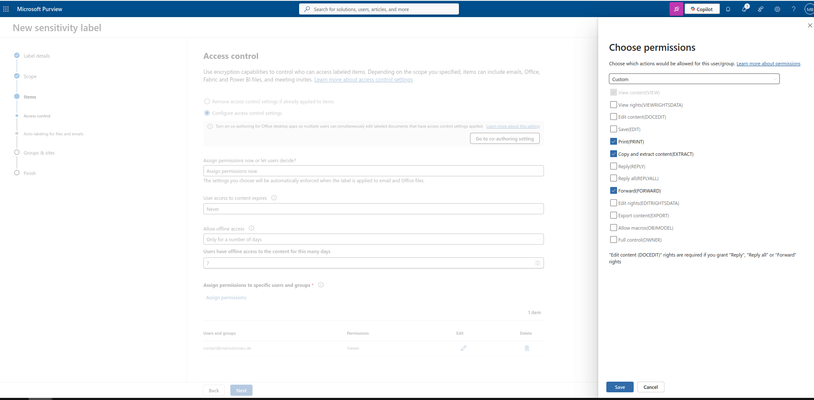
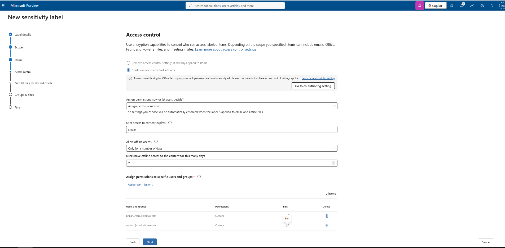

# Microsoft Purview — Sensitivity Labels: Practical Scenarios

This project documents a hands-on exploration of Microsoft Purview Information Protection, focusing on Sensitivity Labels and their practical application in real-world business scenarios.

Rather than following a generic tutorial, each scenario in this project is modeled after common organizational challenges — data classification, access control, external sharing, and compliance requirements — the kind of situations encountered in companies of any size.

The goal is not just to configure labels, but to understand the reasoning behind each design decision: who needs access, what actions should be permitted or restricted, and why a particular configuration was chosen over alternatives.

## What this project covers

Two scenarios are presented, each addressing a different aspect of information protection. Scenario 1 focuses on internal HR document control with external distribution — demonstrating access control, permission granularity, and GDPR considerations. Scenario 2 focuses on external collaboration — demonstrating how protection works when multiple parties outside the organization need controlled access to the same document.

Each scenario is documented in full: business justification, design decisions with trade-offs, configuration details, and observed behavior during testing. Depth over breadth — two complete scenarios demonstrate more than four superficial ones.

## Environment

| | |
|---|---|
| Tenant | Microsoft 365 Business Premium — contact@mariusbrinaru.de |
| Portal | Microsoft Purview compliance portal |

---

## Scenario 1 – Internal Strict Document (HR / Payroll)

---

### Label 1 — Payroll Standard

#### Business Justification

Monthly payroll documents for general staff contain personal and financial data protected under GDPR. These documents are generated as final outputs from the payroll system and must be distributed both internally to management and externally to each employee. Once generated, no modifications are permitted — any corrections must be made in the source payroll system, not in the document itself.

#### Audience

| Recipient | Type |
|---|---|
| All HR team members, HR Manager, CFO, CEO | Internal |
| The respective employee, via their personal email address | External |

#### Permissions

| Recipient | Permissions |
|---|---|
| All internal recipients | Viewer only — no print, no copy, no edit |
| HR Manager, CFO, CEO | View Rights additionally granted — change rights deliberately excluded |
| Employee (external) | View Content, Print, Copy, Forward — edit, save as unprotected, and change rights excluded |

#### Design Decisions

**Why Viewer for all internal recipients, including HR?**
Payroll documents are final at the point of distribution. Granting edit rights to HR staff would create a risk of unauthorized modification after official generation. Corrections follow a formal process through the payroll system itself.

**Why no Change Rights for management?**
Permissions management is the responsibility of the Compliance Administrator, not individual managers. Granting Change Rights to CEO or CFO would technically allow them to escalate their own privileges or modify access for others — a risk that outweighs the convenience. View Rights are sufficient for oversight purposes.

**Why does the employee receive broader permissions than internal management?**
Internal recipients need to see the document, not use it freely. The employee, however, is the legal subject of the data contained in the document and has the right to use it freely — printing for personal records, sharing with a bank or accountant, or archiving it. Restricting these actions would be inconsistent with GDPR data subject rights.

**Why allow external access at all?**
Employees have a legal right to receive their own payroll documents. Restricting access to corporate email only would exclude employees who primarily use personal devices or who have left the company. Once delivered, responsibility for further distribution rests with the employee.

> **Known limitation:** Once the employee accesses the document, Purview cannot prevent them from sharing an unprotected copy through a screenshot or other means. This is an accepted limitation — the label protects against unauthorized third-party access, not against the document owner's own actions.

---

### Label 2 — Payroll Executive

#### Business Justification

Payroll documents for executives (CEO, CFO, HR Manager) require a higher level of confidentiality than standard payroll. These documents must not be accessible to general HR staff, as they contain compensation details for senior leadership. Access is restricted to the minimum set of authorized individuals consistent with the principle of least privilege.

#### Audience

| Recipient | Type |
|---|---|
| HR Manager, CFO, CEO only | Internal |
| The respective executive, via their personal email address | External |

#### Permissions

| Recipient | Permissions |
|---|---|
| All internal recipients | Viewer only — no print, no copy, no edit |
| HR Manager, CFO, CEO | View Rights additionally granted |
| Executive employee (external) | View Content, Print, Copy, Forward — edit, save as unprotected, and change rights excluded |
| Change Rights | Not granted to anyone at document level — managed exclusively at tenant level by Compliance Administrator |

#### Design Decisions

**Why exclude general HR staff?**
While HR staff process standard payroll, executive compensation is typically handled by a smaller, explicitly authorized group. Broad HR access to executive documents creates unnecessary exposure and violates the principle of least privilege.

**Why not grant HR Manager edit rights, given they may oversee corrections?**
The same principle applies as in Label 1 — corrections are made upstream in the payroll system. If HR Manager needs to annotate or comment, that happens through a separate internal process, not by modifying the protected document.

**Why does the executive employee receive the same broader permissions as in Label 1?**
The legal reasoning is identical — the executive is the data subject and retains the right to use their own payroll document freely. Their seniority within the organization does not reduce their rights as an individual.

**Why no Change Rights even for HR Manager?**
HR Manager has View Rights for oversight. Granting Change Rights would allow privilege escalation — adding themselves or others with elevated permissions. This risk is not justified by any operational need, as permissions are managed centrally by the Compliance Administrator.

---

### Screenshots

**Initial state** — Sensitivity Labels before any configuration:

---

#### Label 1 — Payroll Standard

**Step 1 — Adding recipients**
`contact@mariusbrinaru.de` (internal) was added first — visible in the background as Viewer. In the foreground: employee permissions being configured — Print, Copy, Forward enabled. Edit, Save, Change Rights excluded:

**Step 2 — View Rights for internal** (`contact@mariusbrinaru.de`)
View Rights (VIEWRIGHTSDATA) added to the internal recipient. Both recipients now in the list:

**Step 3 — Access Control final state**
Both recipients assigned. Expiry: Never. Offline access: 7 days:

**Step 4 — Review & Finish**

**Step 5 — Created**

---

#### Label 2 — Payroll Executive

**Step 1 — Access Control final state**
Same permission structure as Label 1. General HR staff excluded:

**Step 2 — Review & Finish**

<!-- TODO: Add screenshot – Payroll Executive created confirmation -->

---

#### Final state — Both labels

<!-- TODO: Add screenshot – Sensitivity Labels list with Payroll-Standard and Payroll-Executive -->

### Notes

> **Note on test environment:**
> This is a single-user personal tenant (contact@mariusbrinaru.de).
> User roles are simulated as follows:
> - `contact@mariusbrinaru.de` → represents internal recipients (HR staff, HR Manager, CFO, CEO)
> - `brinaru.marius@gmail.com` → represents external employee

---

## Scenario 2 – External Client Document (View Only, Expiry, No Print)

**Use case:** A document sent to a client. The client can read it, but cannot print, copy, or access it after the expiry date.

### Label configuration

| Setting | Value |
|---|---|
| Label name | `External - Client Confidential` |
| Scope | Files |
| Encryption | Enabled |
| Assign permissions | Authenticated users (external allowed) |
| Allowed roles | Viewer only |
| Content expiry | 30 days from labeling |
| Allow offline access | Never |
| Print | Disabled |
| Copy/paste | Disabled |

### Steps

1. Create label → Name: `External - Client Confidential`
2. Under **Encryption** → Enable → Let users assign permissions: **Do Not Forward**
   - Or: Assign permissions now → Add external domain → `Viewer` only
3. Set **content expiration**: 30 days
4. Disable offline access
5. Under **Content marking** → add footer: `Confidential – External Use Only`
6. Publish to users who send documents to clients

### Screenshot

<!-- Add screenshot: expiry and viewer permissions settings -->

### Notes

---

## Scenario 3 – Collaborative Document with External Partner (Editor with Restrictions)

**Use case:** A shared document with a partner organization. They can edit but cannot share further or remove the label.

### Label configuration

| Setting | Value |
|---|---|
| Label name | `External - Partner Collaboration` |
| Scope | Files |
| Encryption | Enabled |
| Assign permissions | Specific external domain |
| Allowed roles | Co-Author (edit, no re-share) |
| Forward / Share | Disabled |
| Label removal | Requires justification |

### Steps

1. Create label → Name: `External - Partner Collaboration`
2. Under **Encryption** → Assign permissions now
3. Add external domain: `partner-company.com` → Permission level: **Co-Author**
   - Co-Author allows: edit, save — does NOT allow: share, change permissions
4. Under **Label policies** → Enable **Require users to provide justification to remove a label**
5. Optional: add watermark with user's email via **Content marking**
6. Publish to relevant internal teams (e.g. Project Managers, Account Managers)

### Screenshot

<!-- Add screenshot: Co-Author permission level for external domain -->

### Notes

---

## Scenario 4 – Confidential Email (Label Applied to Email, Not Just Files)

**Use case:** An email containing sensitive information (legal, HR, financial). The label prevents forwarding and encrypts the email body and attachments.

### Label configuration

| Setting | Value |
|---|---|
| Label name | `Confidential - Internal Email` |
| Scope | **Emails** (and Files) |
| Encryption | Enabled |
| Do Not Forward | Enabled |
| Encrypt-Only | Optional alternative |
| Auto-labeling | Optional: trigger on keywords (e.g. "salary", "NDA") |

### Steps

1. Create label → Name: `Confidential - Internal Email`
2. Under **Scope** → select **Email** (in addition to Files)
3. Under **Encryption** → Enable → Choose **Do Not Forward**
   - Recipients can read the email but cannot forward, print, or copy content
4. Optional – Auto-labeling:
   - Go to **Auto-labeling policies**
   - Trigger condition: email contains sensitive info types (e.g. `EU Social Security Number`, `Credit Card Number`)
   - Apply label automatically
5. Publish label to all users or specific groups

### Screenshot

<!-- Add screenshot: Do Not Forward setting and email scope selection -->

### Notes

---

## Summary

| Scenario | Label Name | External Access | Expiry | Print | Edit |
|---|---|---|---|---|---|
| HR / Payroll | Internal - Highly Confidential | No | Never | Yes (internal) | Co-Owner / Reviewer |
| Client Document | External - Client Confidential | Yes (view only) | 30 days | No | No |
| Partner Collaboration | External - Partner Collaboration | Yes (edit) | Never | No | Co-Author |
| Confidential Email | Confidential - Internal Email | No forward | Never | No | N/A |
